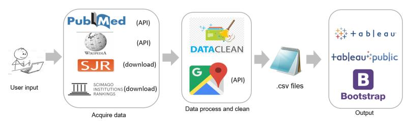

# MedHotSpots

## DESCRIPTION- Describe the data source

Our dataset consists of over 30 million article records from NCBI (National Center for
Biotechnology information) PubMed which contain MeSH word information. Each article is recorded
as a data entry, including title, date of publication, classification number and key word( MeSH term),
author(s), affiliation(s) and reference(s) to other papers within the data set. Then we will combine the dataset with journal list from Scimago Journal & Country Rank and Google Map 

## DESCRIPTION- Project Work Flow


## DESCRIPTION- Describe the package in a few paragraphs
```
import urllib.request
```
The urllib.request module defines functions and classes which help in opening URLs (mostly HTTP) in a complex world — basic and digest authentication, redirections, cookies and more.

```
import ssl
```
SSL Certificates are small data files that digitally bind a cryptographic key to an organization’s details. Often, an website with a SSL certificate is termed as secure website.

```
import sys
```
This module provides access to some variables used or maintained by the interpreter and to functions that interact strongly with the interpreter. It is always available.

```
import pandas as pd
```
[Pandas](https://pandas.pydata.org/) is a fast, powerful, flexible and easy to use open source data analysis and manipulation tool, built on top of the Python programming language.

```
import numpy as np
```
[NumPy](https://numpy.org/) brings the computational power of languages like C and Fortran to Python, a language much easier to learn and use. With this power comes simplicity: a solution in NumPy is often clear and elegant.

```
import xmltodict
```
[xmltodict](https://pypi.org/project/xmltodict/) is a Python module that makes working with XML feel like you are working with JSON. xmltodict is very fast (Expat-based) and has a streaming mode with a small memory footprint, suitable for big XML dumps.

```
import pymed
```
[PyMed](https://pypi.org/project/pymed/) is a Python library that provides access to PubMed through the PubMed API.

```
from pymed import PubMed
```
This library takes care of the following for you:
* Querying the PubMed database (with the standard PubMed query language)
* Batching of requests for better performance
* Parsing and cleaning of the retrieved articles

```
import googlemaps
```
Googlemaps brings the Google Maps Platform Web Services to the Python application.

```
from datetime import date
```
The datetime module supplies classes for manipulating dates and times.

```
from wordcloud import WordCloud, STOPWORDS
```
[WordCloud](https://pypi.org/project/wordcloud/) is a data visualization technique used for representing text data in which the size of each word indicates its frequency or importance. Significant textual data points can be highlighted using a word cloud. Word clouds are widely used for analyzing data from social network websites.

```
import collections
```
[Collections](https://docs.python.org/3/library/collections.html) module implements specialized container datatypes providing alternatives to Python’s general purpose built-in containers, dict, list, set, and tuple.

```http://www.jb51.net/article/103275.htm
from collections import Counter
```
dict subclass for counting hashable objects

```
import nltk
```
[NLTK](https://www.nltk.org/) is a leading platform for building Python programs to work with human language data. It provides easy-to-use interfaces to over 50 corpora and lexical resources such as WordNet, along with a suite of text processing libraries for classification, tokenization, stemming, tagging, parsing, and semantic reasoning, wrappers for industrial-strength NLP libraries

```
from nltk import sent_tokenize
```
Able to extract the syllables from stream of sentence

```
from nltk import word_tokenize
```
Able to extract the syllables from stream of words

```
from nltk import FreqDist
```
[FreqDist](https://www.kite.com/python/docs/nltk.FreqDist) class is used to encode “frequency distributions”, which count the number of times that each outcome of an experiment occurs.

```
import pycountry
```
[Pycountry](https://pypi.org/project/pycountry/) provides the ISO databases for the standards

```
from bibliobanana import compute_yearly_citations
```
[Bibliobana](https://pypi.org/project/bibliobanana/): the average number of citations per year is calculated by dividing the total number of citations by the number of years the author or journal has been publishing papers. This can be a very useful metric to assess the yearly impact for a journal or author.

```
import wikipedia
```
[Wikipedia](https://pypi.org/project/wikipedia/) is a Python library that makes it easy to access and parse data from Wikipedia.Search Wikipedia, get article summaries, get data like links and images from a page, and more. Wikipedia wraps the MediaWiki API so you can focus on using Wikipedia data, not getting it._

```
import pyscopus
```
[PyScopus](https://pypi.org/project/pyscopus/) is a Python wrapper of Elsevier Scopus API.

```
from pyscopus import Scopus
```
[Scopus](https://pypi.org/project/scopus/) is the world's largest abstract and citation database of peer-reviewed

```
import matplotlib.pyplot as plt
```

```
import sklearn 
```
[Scikit-learn](https://github.com/scikit-learn/scikit-learn) is a Python module for machine learning built on top of SciPy and is distributed under the 3-Clause BSD license.

```
from sklearn.cluster import KMeans
```
[K-Means clustering.](https://scikit-learn.org/stable/modules/generated/sklearn.cluster.KMeans.html)

```
from sklearn.preprocessing import OneHotEncoder
```

## INSTALLATION 

For mac user:</br>
```
pip install -r mac_requirements.txt
```

For Windows user:</br>
```
pip install -r windows_requirements.txt
```

-Install tkinter and os  <br>
-Download **the whole folder** from github to your local drive (need to store data)

## EXECUTION
### How to Check Live Online Demo

we have four example:
* we use "alzheimers-disease“ as the search term, please check the "demo/demo1/web demo" folder from github and double click the index.html, which is the visualization page about alzheimers-disease
* we use "coronarirus“ as the search term, please unzip the "demo/demo2/web demo" folder from github and double click the index.html, which is the visualization page about alzheimers-disease
* we use "lung cancer“ as the search term, please unzip the "demo/demo3/web demo" folder from github and double click the index.html, which is the visualization page about alzheimers-disease
* we use "stomach cancer“ as the search term, please unzip the "demo/demo4/web demo" folder package from github and double click the index.html, which is the visualization page about alzheimers-disease

### How to run a new search 

#### 1. To start a new search:
-Open your terminal and cd the folder

**For Windows Users:**
```
python b.py 
```

-Input a term you are interested in <br>

<br>

-Click search, the program will start to run.

**For Mac Users:**
-python run.py [Search Term] <br>
(For instance: python run.py Stomach Cancer)


-Due to the GoogleMap API limitation, it will take about 20 min to prcoess 1500 latest articles, currently we set the max_results=5000, which may take around 1hr for precessing.</br> 

-Our free Google Maps API will be expire on 11/23/2020. Thus, currently, we commented the google Map session. If you want to run that session, you may need to uncomment the code from the run.py file, and fill up with your own Google Maps API.</br>

-Once finishing program running, you will get several, CSV file would be directly downloaded inside of this package of your local drive. 
CSV file you will find in the **same folder** stored in your local drive, including:</br>

* journal_all.csv: including variables pubmed_id, title, abstract, copyrights, publication, authors, keywords, journal, conclusions, methods, results contry, institute, latitude, longitude
* search_clustering.csv: pubmed_id, title, abstract, publication_date, authors, keywords, journal, conclusions, methods, results 
* search_abstract.csv:count,abstract_keyword
* search_journal.csv: journal,	count,	Rank,	Journal, Impact Factor,	Eigenfactor Score
* search_map.csv: pubmed_id, latitude, longitude, institution, country
* search_trend.csv: keywords, count
* search_word_count.csv: year, search_count_from_pubmed
* search_wiki.csv: keyword, summary, url

#### 2. Run Keams-Clustering file:
-Go to jupyter and run kmeans_file.ipynb

#### 3. Refresh Tableau:
-Double click on tableau.twbx, go to Tableau and refresh the data source. Tableau server will be static until the next scheduled refresh, at which time it will get updated with new data. Also drag the updated url from search_wiki.csv to wikipedia page in Tableau<br>

#### 4. Refresh index.html:
-Go to index.html you will see the results. We suggest to use monitor with display resolution 1920x1080 for a better view. <br>


### 

